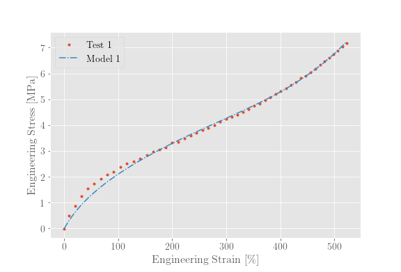

# Jupyter Notebook to characterize the Yeoh material model from tension data using least squares curve fitting.

Please see 'requirements.txt' for the required packages.

## Notebook overview :green_book:
This notebook takes in tension data in the form of a .csv file and calculates the constants for the Yeoh material model. Example tension test data is provided.

## Input Data :chart_with_upwards_trend:
This code requires clean data to accurately characterize the material model. The output data from material tests usually have some bogus data at the start of the test (if the samples were not sufficiently tensioned) or at the end of the test (at or after the sample has broken) or both. It is required that this dat be cleand before attempting to characterize the material.

## Down sampling :bar_chart:
The tesion data that was used when this code was written was extreamly noisy and was sampled at a high frequency. When plotting the data it would become very messy and it was difficult to overlay two or more plots and make any sence of the data. A very crude down sampling function was written to allow for cleaner plots. The downsampling function is not mathematically sound and is only intended for visual representations. It is important to note that the **material characterization is performed on the entire 'original' data set.**

## Stress and strain measures :necktie:
In most cases raw test data can provide the used with **Engineering** stress, strain data. The Yeoh model, however, is calibrated using True stress, strain data. In this code, a simple conversion is used to convert between the two forms. However, it is **not clear** how accurate or appropriate this conversion is for hyper-elastic materials that undergo large deformation. When using this code the user should be aware of this assumption and proceed cautiously.

## Tunable parameters :saxophone:
This code is not plug and play. The user should dig into the code a litte to ensure it is doing what they want and expect. There is a tuneable parameter in the number of desired points when using the downsampling.

## Warning :heavy_multiplication_x:
This code is provided with no gaurantee that it is correct.